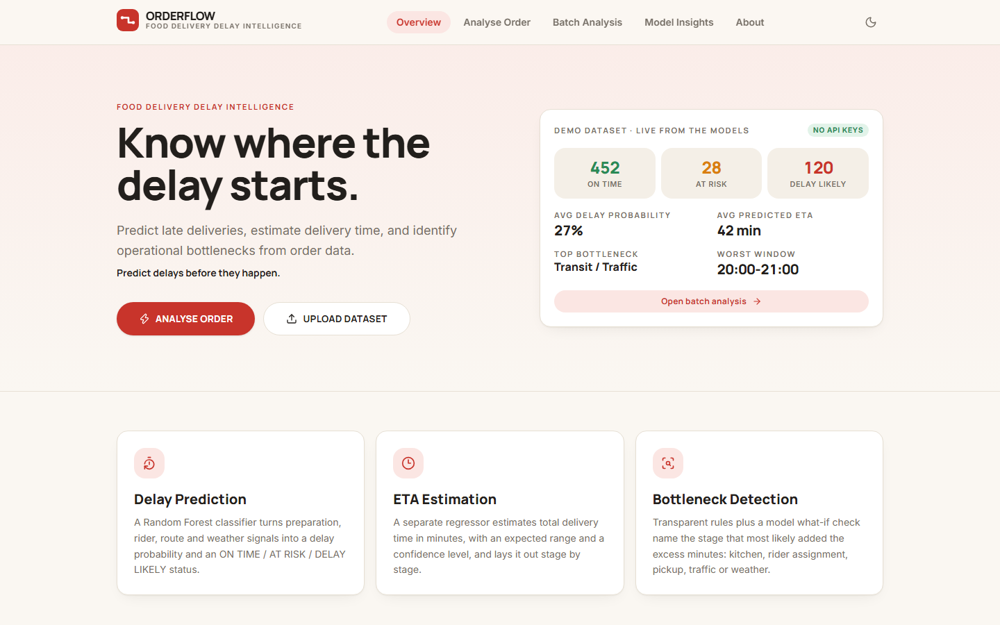
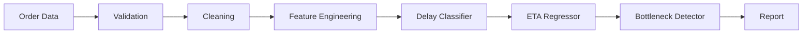
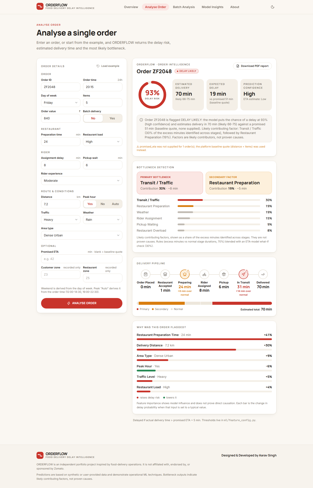
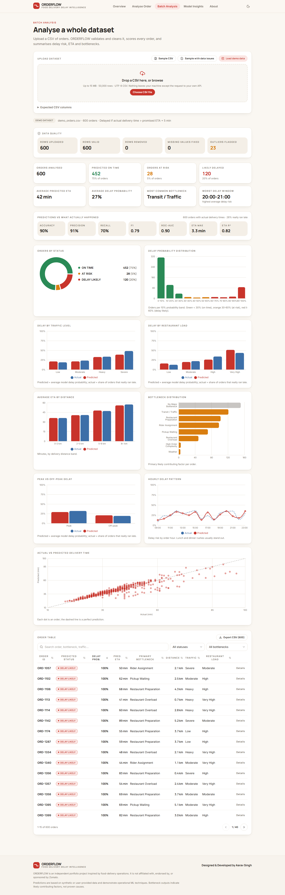
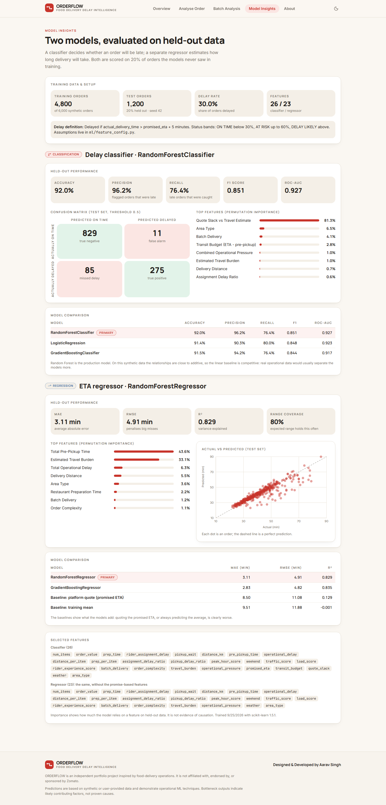
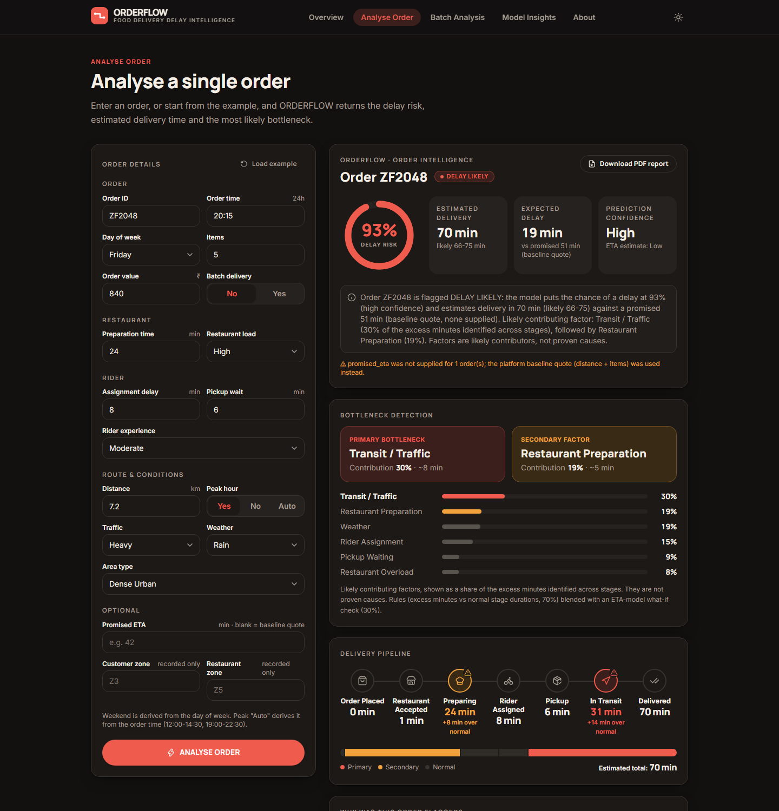
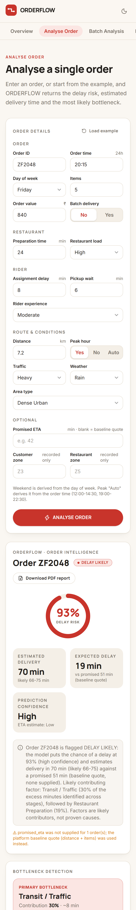

# ORDERFLOW

**Food Delivery Delay Intelligence** · *Predict delays before they happen.*

ORDERFLOW predicts whether food-delivery orders will be delayed, estimates delivery time, and identifies the likely operational bottleneck behind each delay. Upload a CSV or enter a single order and it returns a delay probability, an ETA with an expected range, the most likely bottleneck, a per-order explanation, and a downloadable PDF report.



> ORDERFLOW is an independent portfolio project inspired by food-delivery operations. It is not affiliated with, endorsed by, or sponsored by Zomato.

## Overview

| | |
|---|---|
| **Classification** | RandomForestClassifier → delay probability, status (`ON TIME` / `AT RISK` / `DELAY LIKELY`), confidence |
| **Regression** | RandomForestRegressor → delivery time in minutes, expected range, confidence |
| **Bottleneck detection** | Transparent rules + an ETA-model what-if check → primary / secondary *likely contributing factor* |
| **Explainability** | Per-order occlusion ("why was this order flagged?") and held-out permutation importance |
| **Data handling** | Validation, cleaning and a data-quality summary for every upload |
| **Demo mode** | Preloads 600 held-out synthetic orders. No API keys, no external services |

## Problem Statement

A late delivery is rarely one failure. It is a slow kitchen, a rider who took too long to be assigned, a long wait at pickup, or a slow trip in the rain, and operations teams need to know *which stage* to look at. ORDERFLOW turns raw order data into that answer: will it be late, how long will it take, and where did the time go.

## Pipeline



A single form entry and a 50,000-row CSV take exactly the same code path (`backend/model_service.py`).

## Features

- **Analyse Order**: manual form with the worked example preloaded. Result card, bottleneck card, a seven-stage delivery timeline (Order Placed → Restaurant Accepted → Preparing → Rider Assigned → Pickup → In Transit → Delivered) with the likely delay stage highlighted, and "Why was this order flagged?" bars.
- **Batch Analysis**: CSV upload, data-quality summary, KPI tiles (orders analysed, on time / at risk / likely delayed, average ETA, average delay probability, most common bottleneck, worst delay window), nine charts, and a searchable / filterable / sortable order table with CSV export. "Details" re-analyses any row in full.
- **Model Insights**: classification and regression kept visibly separate, with metrics, confusion matrix, model comparison, top features and actual-vs-predicted.
- **PDF report** for any analysed order.
- Light and dark themes, mobile layout, no authentication, no admin panel.



## Machine Learning

Both models use a scikit-learn `Pipeline` (`ColumnTransformer` with one-hot encoding for weather and area type), fixed `random_state=42`, and the **same stratified 80/20 split**. Nothing is fitted on the test set. Every reported number below is on the 1,200 held-out orders.

### Delay Classification

Target: `Delayed` if `actual_delivery_time > promised_eta + 5 min` (configurable, see [Delay definition](#delay-definition)).

| Model | Accuracy | Precision | Recall | F1 | ROC-AUC |
|---|---|---|---|---|---|
| **RandomForestClassifier** (primary) | 92.0% | 96.2% | 76.4% | 0.851 | 0.927 |
| LogisticRegression | 91.4% | 90.3% | 80.0% | 0.848 | 0.923 |
| GradientBoostingClassifier | 91.5% | 94.2% | 76.4% | 0.844 | 0.917 |

Confusion matrix (threshold 0.5): 829 true on-time, 11 false alarms, 85 missed delays, 275 caught delays. Precision is high and recall lower: the model rarely cries wolf but misses some delays that come from things it cannot see (an unobserved incident is simulated for about 10% of orders). Probabilities are not recalibrated.

The linear baseline is competitive because the synthetic relationships are close to additive. That is reported as-is rather than tuned away.

The classifier knows the promised ETA, because "late" is defined against that promise. Features: the raw stage times, engineered ratios and scores, plus `promised_eta`, `transit_budget` (promise minus pre-pickup time) and `quote_slack` (that budget against a prior-based travel estimate).

### ETA Regression

Target: total delivery time in minutes. The regressor **never sees the promise** or the target.

| Model | MAE (min) | RMSE (min) | R² |
|---|---|---|---|
| **RandomForestRegressor** (primary) | 3.11 | 4.91 | 0.829 |
| GradientBoostingRegressor | 2.83 | 4.82 | 0.835 |
| Baseline: promised ETA | 8.50 | 11.08 | 0.129 |
| Baseline: training mean | 9.51 | 11.88 | -0.001 |

The expected range is the 10th-90th percentile of held-out residuals (it covers 80% of test orders by construction). ETA confidence comes from how much the individual trees disagree.

### Bottleneck Detection

For each order the detector scores seven factors in *excess minutes*:

| Factor | Rule |
|---|---|
| Restaurant Preparation | prep time beyond `7 + 1.8 × items` min (minus the share blamed on load) |
| Restaurant Overload | the share of that excess blamed on load: 30% (High), 60% (Very High) |
| Rider Assignment | assignment delay beyond 3 min |
| Pickup Waiting | pickup wait beyond 3 min |
| Transit / Traffic | free-flow trip time × (traffic multiplier − 1) |
| Weather | free-flow trip time × traffic × (weather multiplier − 1) |
| High Order Complexity | 1.5 min per item beyond 6, plus 3 min for batch deliveries |

70% of each score is that rule; 30% is a **what-if check on the ETA model** (reset that one factor to normal, re-predict, read the drop in ETA). The largest score is the primary bottleneck, the second the secondary, and contributions are shares of the identified excess minutes. Under 3 minutes it reports **No Major Bottleneck**. The wording everywhere is *likely contributing factor*: this is not causal inference, and feature importance does not prove causation.

### Synthetic Dataset

`backend/synthetic_data.py` generates 3,000-8,000-order datasets where Heavy/Severe traffic, rain and distance stretch transit; high restaurant load inflates prep time; peak hours load kitchens and thin out riders; long assignment delays and pickup waits add straight to the total. Randomness is everywhere: noisy traffic labels, a ~10% unobserved-incident rate (+5-22 min), rare restaurant outages and rider shortages, and a promised ETA that starts from distance and basket size but only partly reflects live conditions.

```bash
python generate_dataset.py                                # all datasets below (deterministic seeds)
python generate_orders.py --n 5000 --seed 7 --out my.csv  # a single custom file
```

| File | Rows | Purpose |
|---|---|---|
| `data/training_orders.csv` | 6,000 | trains both models (30% delayed) |
| `data/demo_orders.csv` | 600 | demo mode. Generated with a different seed, **never seen in training** |
| `data/sample_orders.csv` | 200 | clean file to try the upload |
| `data/sample_orders_with_issues.csv` | 203 | negative times, zero distance, bad categories, malformed times, duplicates, missing values |

Because the data is generated by rules that the feature engineering partly mirrors (the traffic and weather multipliers are documented priors), scores here say the pipeline works, not that it would score the same on a real platform.

### Delay definition

```python
# ml/feature_config.py
DELAY_GRACE_MINUTES = 5   # Delayed if actual_delivery_time > promised_eta + DELAY_GRACE_MINUTES
```

Override with `ORDERFLOW_DELAY_GRACE_MIN`. The service retrains automatically when it changes. Status bands (`ON TIME` < 30% ≤ `AT RISK` < 60% ≤ `DELAY LIKELY`) live in the same file. Predictions are made once the restaurant and rider stages are known, so preparation, assignment delay and pickup wait are inputs.

## Screenshots

| Batch analysis | Model insights |
|---|---|
|  |  |

| Dark mode | Mobile |
|---|---|
|  |  |

A sample of the generated report is in [`docs/sample-report.pdf`](docs/sample-report.pdf).

## Architecture

```
orderflow/
├── backend/            FastAPI app (flat modules, run from this folder)
│   ├── main.py             routes, error handling
│   ├── schemas.py          Pydantic input models
│   ├── data_cleaner.py     validation + cleaning + data-quality summary
│   ├── feature_engineering.py
│   ├── delay_predictor.py  classifier pipeline + status/confidence
│   ├── eta_predictor.py    regressor pipeline + range/confidence
│   ├── bottleneck_detector.py
│   ├── explainer.py        per-order occlusion explanation
│   ├── analytics.py        batch summary + chart series
│   ├── model_service.py    loads/trains models, runs the whole pipeline
│   ├── report.py           PDF (ReportLab)
│   ├── synthetic_data.py   generator
│   └── tests/              pytest (59 tests)
├── ml/                 feature_config.py · train_delay_model.py · train_eta_model.py · evaluate.py · models/
├── data/               generated CSVs
├── frontend/           Next.js 16 · React 19 · TypeScript · Tailwind 4 · Recharts · Framer Motion
├── generate_orders.py · generate_dataset.py
└── scripts/            train_all.py · screenshots.mjs
```

API:

| Endpoint | |
|---|---|
| `POST /api/order/analyze` | single order → full analysis |
| `POST /api/orders/batch` | multipart CSV → quality summary, KPIs, chart series, scored orders |
| `GET /api/model/metrics` | held-out metrics, comparison tables, importance |
| `GET /api/demo/orders` | the preloaded demo batch |
| `GET /api/sample-csv?kind=clean\|issues` | downloadable sample CSVs |
| `POST /api/report/order` | PDF report |
| `GET /api/health` | status + active delay rule |

Errors are readable: every 422 carries `detail.message` and a row-level `issues` list (for example `Row 26: malformed order_time '25:99'`). Interactive docs at `/docs`.

## Installation

Requirements: Python 3.11+, Node 20+.

### Backend Setup

```bash
cd backend
python -m venv .venv && source .venv/bin/activate    # Windows: .venv\Scripts\activate
pip install -r requirements.txt
uvicorn main:app --port 8000
```

On first start the models train automatically (about 30 s) into `ml/models/` and are reused afterwards. To train explicitly: `python scripts/train_all.py`.

### Frontend Setup

```bash
cd frontend
npm install
cp .env.example .env.local      # API_URL=http://127.0.0.1:8000
npm run dev                     # http://localhost:3000
```

The browser only talks to the Next.js origin, which forwards `/api/*` to the backend, so no CORS setup is needed.

### Demo Mode

`NEXT_PUBLIC_DEMO_MODE=true` (the default) preloads the 600 held-out synthetic orders: the home page snapshot, every batch chart and the order table are populated on first open, and the Analyse page opens with the worked example already scored. No API keys are required. Set it to `false` to start empty.

### Checks

```bash
cd backend  && python -m pytest                       # 59 tests: cleaner, features, models, bottlenecks, API, PDF
cd frontend && npm run typecheck && npm run lint && npm test && npm run build
```

## CSV Format

Required: `order_id, order_time, num_items, order_value, prep_time, restaurant_load, rider_assignment_delay, pickup_wait, distance_km, traffic_level, weather, area_type, rider_experience`, plus `day_of_week` (unless `order_time` includes a date). Optional: `peak_hour`, `promised_eta`, `actual_delivery_time`, `customer_zone`, `restaurant_zone`, `batch_delivery`.

| Field | Accepted |
|---|---|
| `order_time` | `20:15`, `8:15 PM`, or a full date-time |
| `traffic_level` | Low · Moderate · Heavy · Severe |
| `weather` | Clear · Rain · Fog · Hot · Cold |
| `area_type` | Urban · Dense Urban · Suburban |
| `restaurant_load` | Low · Moderate · High · Very High |
| `rider_experience` | New · Moderate · Experienced |

Text and units are normalised (`Rs. 1,240`, `24 min`, `very high`, `fri`). With `actual_delivery_time` and `promised_eta` present, ORDERFLOW also scores its own predictions against what happened. Without `promised_eta` it uses a baseline quote from distance and basket size and says so.

**Validation** rejects (with the row and reason): negative times, zero or negative distance, impossible order values, invalid categories, malformed dates, duplicate order IDs, implausible values, empty files, and missing required columns. **Cleaning** imputes only safe fields (assignment delay, pickup wait, order value, categoricals), never guesses preparation time, distance or item count, flags extreme outliers (IQR fence or hard limits) and clips them, and reports rows uploaded / valid / removed, missing values fixed and outliers flagged.

## Deployment

- **Frontend**: any Next.js host (Vercel). Set `API_URL` to the backend's public URL at build time and `NEXT_PUBLIC_DEMO_MODE`.
- **Backend**: `docker build -t orderflow-api . && docker run -p 8000:8000 orderflow-api` (models are trained during the image build). Set `ORDERFLOW_CORS_ORIGINS` only if a browser calls it directly.

## Limitations

- Predictions are based on synthetic or user-provided data.
- The project does not have access to Zomato's internal systems.
- Predictions are demonstrations of operational ML techniques, not production forecasts.
- Bottleneck outputs indicate likely contributing factors rather than proven causes; feature importance and the "why flagged" bars show model influence, not causation.
- Because most stage durations are inputs, this is an *in-flight* predictor (rider matched, kitchen progress known), not a forecast at order-placement time.
- Synthetic relationships are simpler than real operations; the normal-duration benchmarks and traffic/weather multipliers are documented priors and would need calibrating on real data.
- Random-forest probabilities are not recalibrated, and trees cannot extrapolate beyond the value ranges they trained on.

## Future Improvements

- Calibrate probabilities (isotonic / Platt) and tune the status bands to a cost of a missed delay vs a false alarm.
- Learn stage benchmarks and traffic/weather multipliers from data instead of using priors.
- Time-based train/test splits and drift monitoring for real order streams.
- SHAP-based local explanations alongside the occlusion method.
- Placement-time mode that predicts prep and assignment delay instead of taking them as inputs.

## Author

Designed & Developed by **Aarav Singh**.

## Disclaimer

ORDERFLOW is an independent portfolio project inspired by food-delivery operations. It is not affiliated with, endorsed by, or sponsored by Zomato.
